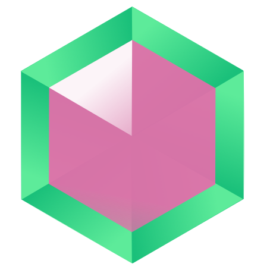

# Tourmaline
Tourmaline is a programming language inspired good points of many other languages.

- I welcome PR!

# Development Status
Lexer is complete.
Parser and Codegen are not complete. (Parser can parse a few syntaxs into AST. Codegen, too.(detail in source code..))

# Logo

Current logo design: 

